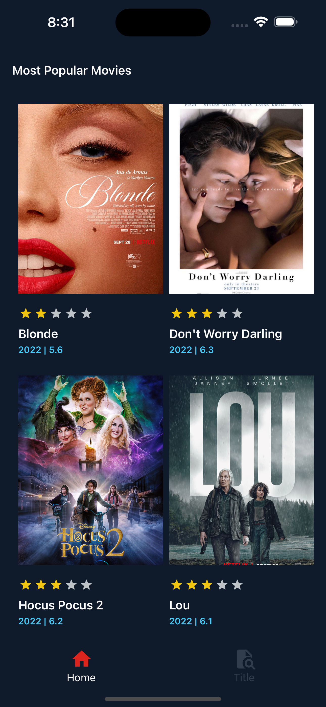
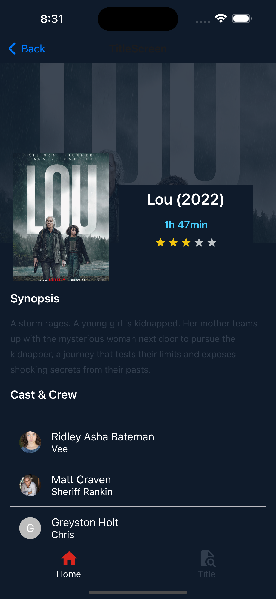

# Movie Catalog App




## Getting Started

This is a react native mobile application. This app code is pre-loaded with some basic libraries and basic app architecture.

App list down the list movie data using using open api service - https://imdb-api.com/api/
<br></br>

## How to Use

**Step 1:**

Download or clone this repo by using the link below:

```
git clone https://github.com/Sherange/movie-catalog.git
```

**Step 2:**

Go to project root and execute the following command in console to get the required dependencies:

```
yarn install
```

**Step 3:**

Execute the following command to run project in IOS:

```
yarn start
```

```
yarn run ios
```

<br></br>

## App Features:

- Main Screen - movie list view with bottom navigation
- Title Screen - movie detail info with crew list
- Search Screen - search movie info
  <br></br>

### Libraries & Tools Used

- [Redux Toolkit](https://redux-toolkit.js.org)
- [React Navigation](https://reactnavigation.org)
- [React Native Vector Icons ](https://github.com/oblador/react-native-vector-icons)

<br></br>

### Folder Structure

Here is the core folder structure which used for this app.

```
react-native-app/
|- android
|- ios
|- src
```

Here is the folder structure we have been using in this project

```
src/
|- components/
|- constants/
|- navigation/
|- redux/
|- screens/
|- App.js
```

Source folder which has the main code for the application.

```
1 components
  - Contains the common UI components of the application like Loaders Buttons InputFields
2 constants
  - All the application level constants are defined in this file. contains the constants for `theme`, `urls` and `strings`
3 navigation
  — Contains the app navigation files like stack navigation and bottomtab navigation
5 redux
  — Contains the redux store of the application and redux-slice that comes with reducers and action dispatchers .
4 screens 
  — Contains the screen UIs and components for the specific screen. For example, Main screen title, Details screen info etc.
5 App.js
  - This is the starting point of the application. All the application level configurations are defined in this file i.e, Providers, Navigation container
```
